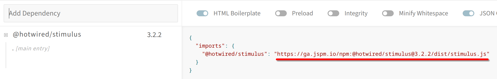

.. include:: /Includes.rst.txt

.. _config-examples:

======================
Configuration Examples
======================

Do do I configure my own importmap?
===================================

The importmap is configured by setting the key "importmap" at the PAGE-object
of you TYPO3 configuration. TYPO3 works mainly by the use of the TypoScriptFrontendController.
That controller is configured through the PAGE-object you usually specify at the page variable
within your provider extension. The importmap is defined at the first level of PAGE-object:

.. code-block:: typoscript

   page = PAGE
   page.importmap {
        # importmap definition comes here
   }

The importmap definition always has an **application** key at which the **path** property is set.
The application key always refers to the bootstrap script which is first executed.
An configuration to bootstrap your application looks like this:

.. code-block:: typoscript

   page.importmap {
        application {
            path = EXT:your_extension/Resources/Public/JavaScript/application.js
        }
   }

The application key is mandatory and only the path to the script has to be set.
Note that it points to a Public path within the Resources folder of your provider extension.

How do I add further modules to the importmap?
==============================================

You can add as many modules as you like with the following syntax:

.. code-block:: typoscript

   page.importmap {
        moduleKey1 {
            path = EXT:your_extension/Resources/Public/JavaScript/module1.js
        }
        moduleKey2 {
            path = EXT:your_extension/Resources/Public/JavaScript/module2.js
        }
   }

Make sure that the JS file is located under the Public folder.

How to find the ES module of your favorite JS library?
======================================================

Any ES module can be used for the importmap. To download your favorite JS library you have to
find the bundled version of it, download it under/to your extensions Public folder and reference
it in the importmap definition. Feel free to use the following tool to find links to your
ES module, goto `JSPM Generator https://generator.jspm.io/`__. Add you library on the left hand side.
An example could be: @hotwired/stimulus

   Example on how to download ES modules.

After adding it you should see the URL to the module, copy the URL to your browser and download the JS
file into your extensions Public/JavaScript/ folder. After that you reference it in your TypoScript like so:

.. code-block:: typoscript

   page.importmap {
        stimulusjs {
            path = EXT:your_extension/Resources/Public/JavaScript/stimulus.js
        }
   }

How do I preload modules?
=========================

Modules are preloadable. The extension generates a link-tag with a rel-attribute which signals
the browsers to preload this module which makes running it even faster. As follows is an example
of module preloading:

.. code-block:: typoscript

   page.importmap {
        stimulusjs {
            path = EXT:your_extension/Resources/Public/JavaScript/stimulus.js
            preload = 1
        }
   }

How to override the module key used for importing?
==================================================

Modules are referenced by the entry key of the module definition, e.g. page.importmap.**stimulusjs**
Here is an example of how you might structure your TypoScript:

.. code-block:: typoscript

   page.importmap {
        modules/stimulusjs {
            path = EXT:your_extension/Resources/Public/JavaScript/modules/stimulus.js
            preload = 1
            overrideModuleName = stimulus
        }
        controllers/header_controller {
            path = EXT:your_extension/Resources/Public/JavaScript/controllers/header_controller.js
            preload = 1
        }
   }

Now you could import the stimulus JS module with this command while keeping the TypoScript more
organized and reflecting that structure within the Public folder:

.. code-block:: js

    import { Application } from 'stimulus'
    import HeaderController from 'controllers/header_controller'
