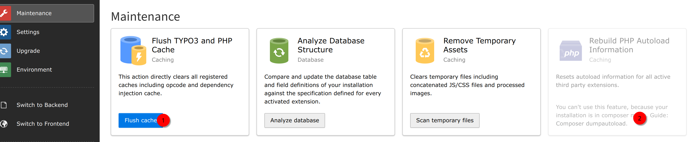

.. include:: /Includes.rst.txt

.. _installation:

============
Installation
============

Install with composer
=====================

This extension is simply installed with one command over the comfortable composer command line:

.. code-block:: bash

   composer require atkins/importmap

Install without composer (Legacy installations)
===============================================

If you're using legacy systems without composer you can install it with the Extension Manager
searching for the key :guilabel:`importmap`.

Clear cache
===========

Make sure to clear your cache and rebuild the autoload information. At legacy installations
both is done at the maintenance tab:

   Click "flush cache" and "rebuild autoload information" if available.

You can manually rebuild the autoload information at composer installation like so:

.. code-block:: bash

   composer dumpautoload