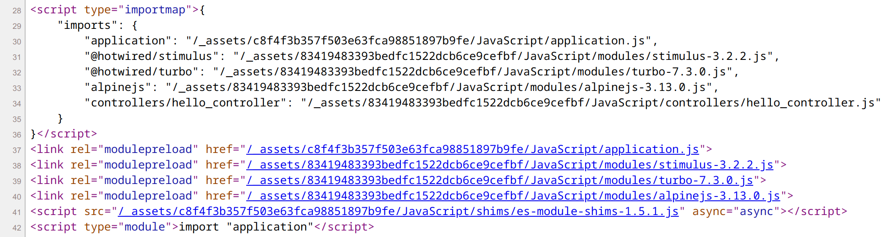

.. include:: /Includes.rst.txt

.. _introduction:

============
Introduction
============

.. _what-it-does:

What does it do?
================

The extension `importmap` is providing a middleware which is executed when a request
is sent to the TYPO3 frontend. It hooks into the frontend controller and outputs four
type of html-tags within the head-tag. These tags contain an importmap.
That map is basically a JSON object with keys and links which are used to import
ES modules at the top of javascript files.

The advent of HTTP2 requests have made the cost to send multiple HTTP requests quite
insignificant. Importmaps utilize this performance boost while keeping the complexity
of managing JavaScript ES modules low.

.. _which-tags-generated:

Which html-tags are generated?
==============================

Four type of html-tags are generated: The importmap, modulepreload link-tags,
a shim to extend browser support, the "bootstrap" import statement for the application.

   An example of the EXT:pagedoctor_starter extension providing an importmap.

.. _features:

Features
========

Once installed this extension is automatically loaded on each frontend request.
Simply specify a YAML configuration at the settings.yaml file within your site set.
The needed html-tags are then generated.

A list of functions:

* Easy YAML configuration
* Support Bootstrapping through an starting import statement
* Easily preload modules through link-tags
* Override module names to keep visual order in YAML file
